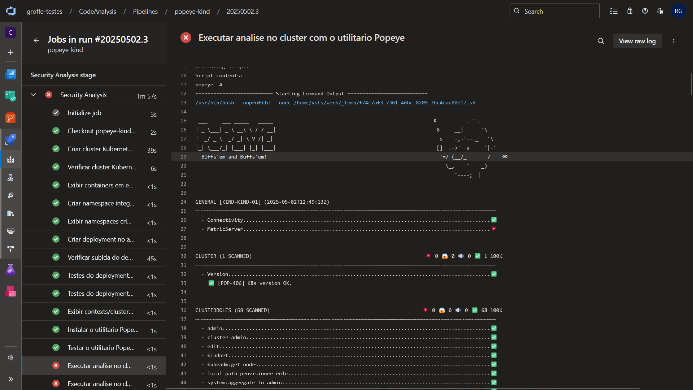
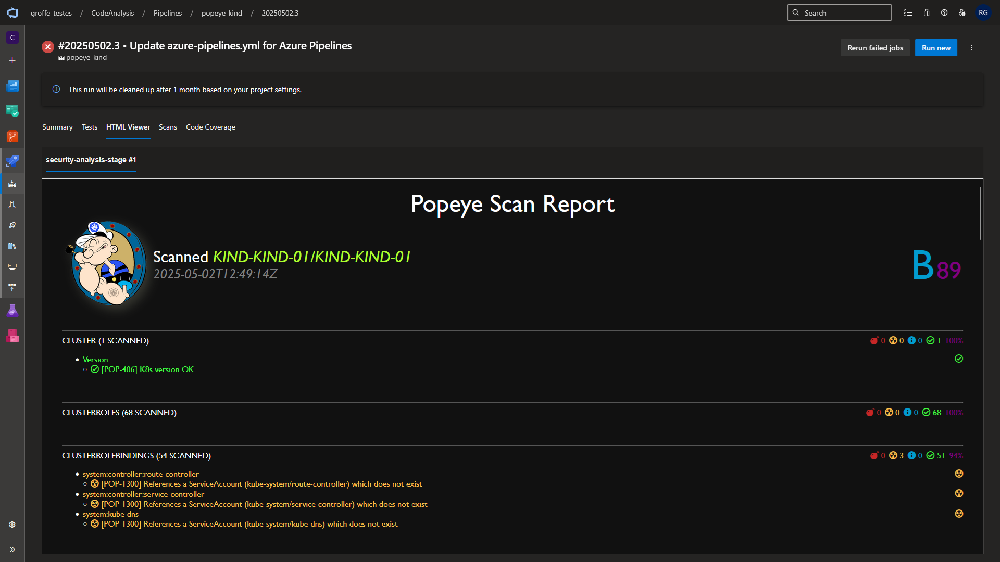
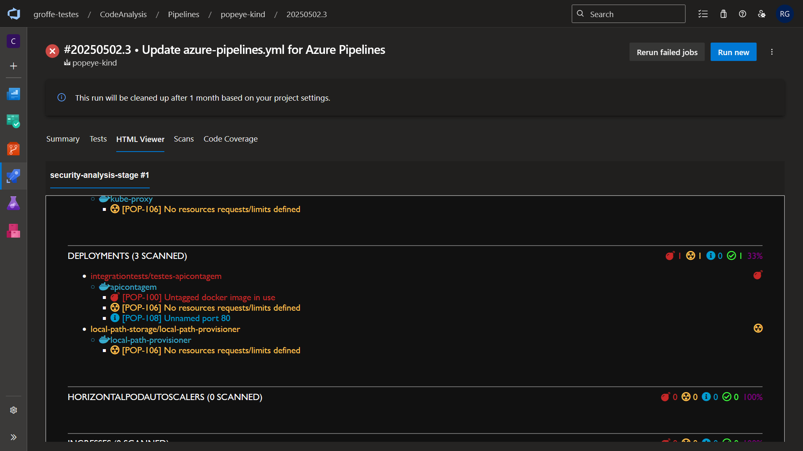
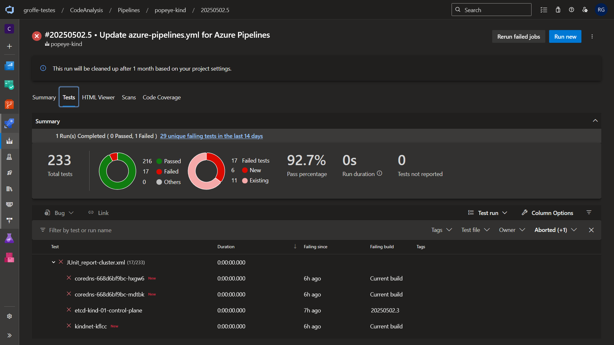
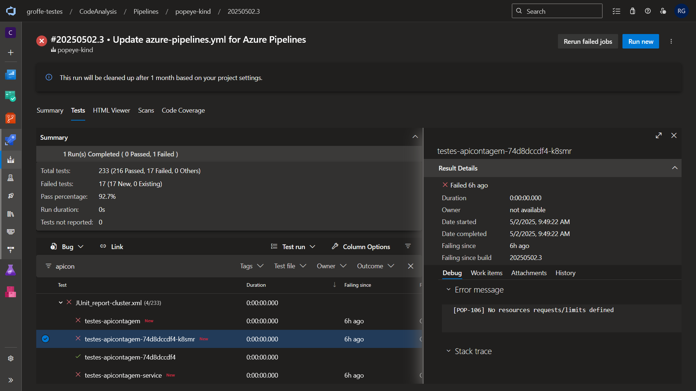

# AzureDevOps-Popeye-Kubernetes-kind
Pipeline do Azure DevOps demonstrando o uso da ferramenta Popeye no scan de vulnerabilidades em cluster Kubernetes gerado via utilitário kind. Inclui geração de relatório em HTML e no padrão JUnit (.xml).

Links importantes:
* Projeto Popeye: https://github.com/derailed/popeye
* kind (emulador Kubernetes): https://kind.sigs.k8s.io/

Aproveito este espaço para agradecer a meu amigo [Daniel Dias Assumpção](https://github.com/dassump) pela indicação desta excelente ferramenta (Popeye).

## Resultados

Utilitário Popeye executado exibindo os resultados da análise em stdout:

Relatório HTML gerado a partir de uma análise com o Popeye:

Resultados gerados seguindo o padrão do JUnit e com visualização da análise no Dashboard de testes do Azure Pipelines:

